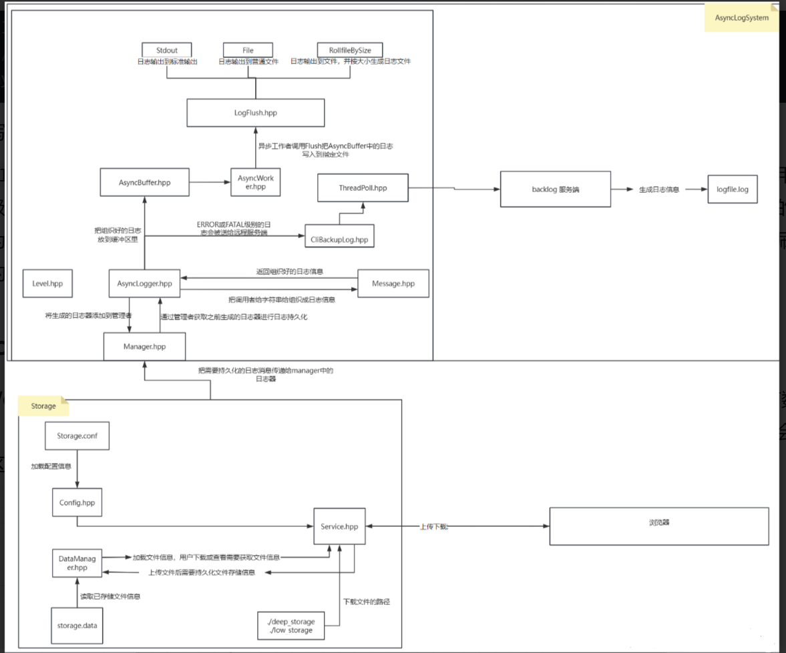
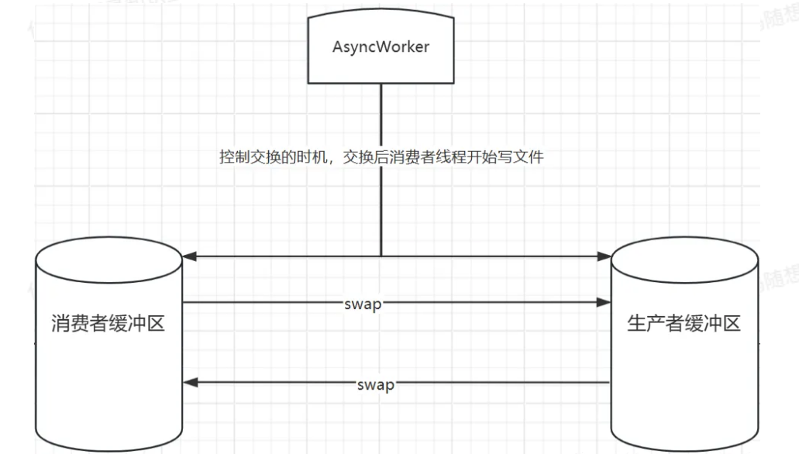
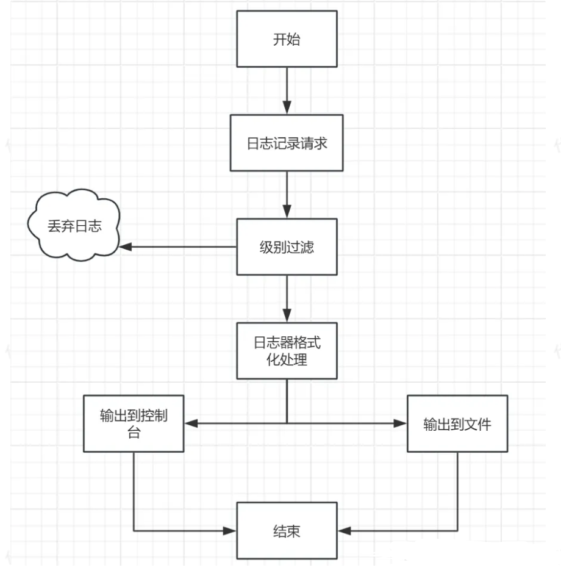

## 项目概述

本项目基于**libevent**网络库实现文件上传服务，支持上传下载和展示功能，支持多种存储等级的存储服务，并携带了异步日志系统，支持备份重要日志，多线程并发写日志等功能。
src下的client为win客户端，可以不实现，直接使用web端与服务端交互。

## 环境准备

Ubuntu22.04 LTS

g++安装

```bash
sudo update
sudo apt install g++
```

### 日志部分

#### 1. jsoncpp

```bash
sudo apt-get libjsoncpp-dev
其头文件所在路径是：/usr/include/jsoncpp/json
动态库在：/usr/lib/x86_64-linux-gnu/libjsoncpp.so-版本号
编译时需要根据动态库的路径进行正确的设置，否则很容易出现“undefined reference to”问题。
使用g++编译时直接加上“-ljsoncpp”选项即可。
```

### 存储部分

### 服务端

#### 1. libevent

Linux下安装方法：

```bash
sudo apt-get update
sudo apt-get install build-essential autoconf automake
sudo apt-get install libssl-dev
./configure
wget https://github.com/libevent/libevent/releases/download/release-2.1.12-stable/libevent-2.1.12-stable.tar.gz
tar xvf libevent-2.1.12-stable.tar.gz  //解压下载的源码压缩包，目录下会生成一个libevent-2.1.12-stable目录
cd libevent-2.1.12-stable                 //切换到libevent-2.1.12-stable目录,(安装步骤可以查看README.md文件)
./configure                                     //生成Makefile文件，用ll Makefile可以看到Makefile文件已生成
make                                          //编译
sudo make install                            //安装

# 最后检测是否成功安装
cd sample     //切换到sample目录
./hello-world   //运行hello-world可执行文件
# 新建一个终端，输入以下代码
nc 127.1 9995 //若安装成功，该终端会返回一个Hello, World!
```

#### 2. jsoncpp

日志部分已经安装

#### 3. bundle

源码链接：https://github.com/r-lyeh-archived/bundle

克隆下来包含bundle.cpp与bundle.h即可使用 
#### 4. cpp-base64
`git clone https://github.com/ReneNyffenegger/cpp-base64.git`
之后把该目录内的base64.h和.cpp文件拷贝到本项目文件src/server/下即可使用

### web端
ip+port即可访问

## 运行方式
先把Kama-AsynLogSystem-CloudStorage/src/server目录下的Storage.conf文件中的下面两个字段配好，如下面，替换成你自己的服务器ip地址和要使用的端口号，（如果使用的是云服务器需要去你买的云服务器示例下开放安全组规则允许外界访问该端口）。
```
"server_port" : 8081,
"server_ip" : "127.0.0.1"
```
再把Kama-AsynLogSystem-CloudStorage/log_system/logs_code下的config.conf文件中的如下两个字段配好，这两个字段是备份日志存放的服务器地址和端口号。（这个配置是可选的，如果没有配置，会链接错误，备份日志功能不会被启动，但是不影响其他部分日志系统的功能，本机还是可以正常写日志的）
```
"backup_addr" : "47.116.22.222",
"backup_port" : 8080
```
把log_stsytem目录下的backlog目录中的ServerBackupLog.cpp和hpp文件拷贝置另外一个服务器或当前服务器作为备份日志服务器，使用命令`g++ ServerBackupLog.cpp`生成可执行文件，`./a.out 端口号` 即可启动备份日志服务器，这里端口号由输入的端口号决定，要与客户端config.conf里的backup_port字段保持一致。

在CloudLogix/src/server目录下使用make命令，生成test可执行文件，./test就可以运行起来了。
打开浏览器输入ip+port即可访问该服务，
或按照上方可选客户端实现，启动客户端后添加文件到对应文件夹即可上传文件

## 结构

# 日志部分
## 模块
├── AsyncBuffer.hpp 异步缓冲区模块  
├── AsyncLogger.hpp 异步日志器模块  
├── AsyncWorker.hpp 异步工作者模块  
├── Flush.hpp 日志持久化模块  
├── Level.hpp 日志等级模块  
├── Manager.hpp 异步日志器管理模块  
├── Message.hpp 日志消息生成模块  
├── MyLog.hpp  
├── ThreadPoll.hpp 建议线程池  
├── Util.hpp  
├── backlog 远程备份模块  
│ ├── CliBackupLog.hpp  
│ ├── ServerBackupLog.cpp  
│ └── ServerBackupLog.hpp  
└── config.conf
## AsyncLogger .hpp 异步日志器模块  
AsyncLogger 是一个日志器，包含一个异步日志器类和创建日志器的建造者，其中实现了各个日志等级的日志消息组织方式。并最终通过该日志器调用异步工作者进行一个实际的写日志。创建日志器的类使用了**建造者模式**，方便后续做扩展其他特性的日志器。  
所有的操作将会在这里被调用。具体来说，用户需要写一条日志时，**首先得生成一个异步日志器即AsyncLogger类对象，然后将其添加到日志器管理模块中**，  

当一条写日志语句被调用后（  
如：mylog::GetLogger("asynclogger")->Info("NewStorageInfo end");，将会经过：将该调用语句中的日志等级、日志语句所在文件名、文件行、日志器的名称以及用户给的字符串进行解析，序列化解析后的各个字段使其成为预定的格式，确定日志等级，以及确认是否是ERROR或FATLE级别的日志等过程，最后再调用刷新数据到文件的逻辑。  
## AsyncWorker .hpp 异步工作者模块  
AsyncWorker 是一个异步线程，当日志器被建造后，异步工作者就会启动，**检测到AsyncBuffer中没有数据时，会阻塞**，等待消费者缓冲区内有数据时则会交换缓冲区，生产者与消费者身份对调，该生产者缓冲区将会变成消费者缓冲区，最后对消费者缓冲区中的数据进行刷新到文件。  


该异步工作者包含两种模式，安全和非安全，对应的意思就是**是否允许缓冲区增长**，非安全就不限制缓冲区的增长，一般用于测试，否则的话可能会导致缓冲区过大导致内存不足。安全模式下当缓冲区不足会阻塞等待其他日志被消费掉。该类使用条件变量的方式唤醒线程，满足条件则会交换缓冲区唤醒消费者去读取缓冲区中的内容写入到磁盘。callback就是在日志器生成的时候传入的RealFlush函数。  
## Flush .hpp 日志持久化模块  
Flush 是用来**控制日志数据该输出到哪里**的，具体的比如终端，文件，以及按照文件大小滚动文件中，文件大小可在config.conf中配置。包含一个工厂类用于创建Flush类。在该类实例化的时候。  
## Level .hpp 日志等级模块  
Level 是**日志等级类**，规定了该日志系统的日志等级如DEBUG，INFO，ERROR  
## Message .hpp 日志消息生成模块  
当请求写入日志时如mylog::GetLogger("asynclogger")->Info("NewStorageInfo end");，会将用户传入的字符串中的各种参数给到该对象，然后对该文件中的LogMessage对象中的成员变量进行赋值，**并返回组织好的日志消息**，如
## Manager .hpp 异步日志器管理模块  
Manager是管理AsyncLogger**日志器的管理者**，具体在代码上就是实现为了一个全局单例，当用户生成一个日志器后会被添加进来，当后续用户还需要用某个日志器的时候根据日志器的名字获取该日志器即可，这也是为什么在建造日志器的时候必须要有日志器的名字。实现很简单，直接看代码就能看懂。其中包含一个默认的日志器，该Manager类实例化的时候会默认加入到该类里。  
## Mylog .hpp  
MyLog 是一些宏函数，简化用户操作  
## ThreadPoll 简易线程池模块  
ThreadPoll 在备份重要日志的时候使用池中的线程进行网络IO  
1创建线程池时，启动指定数量的线程，这些线程会进入<font color="#ff0000">等待状态</font>，等待任务队列中有新任务。  
2当有新任务到来时，调用 enqueue 函数将任务添加到任务队列中，并唤醒一个等待的线程。  
3被唤醒的线程从任务队列中取出任务并执行。  
4当需要销毁线程池时，设置 <font color="#ff0000">stop 标志位为 true</font>，唤醒所有线程，等待它们结束。  
## Util .hpp 工具类  
一些工具函数，包含了读取配置文件的<font color="#ff0000">json反序列化操作，文件操作</font>等  
## config .conf  
这个文件里放的是配置文件，使用json格式组织，字段含义如下  

```c
{

"buffer_size": 10000000, # 一个AsyncBuffer的大小/字节

"threshold": 10000000000, # AsyncBuffer按自身大小的倍数增加，当大小到达该字段时，停止倍数增加

"linear_growth" : 10000000, # AsyncBuffer 达到threshold时，采用这种方式线性增长的方式增加容量

"flush_log" : 2, # 为1时，调用fflush，为2时调用fflush后调用fsync

"backup_addr" : "47.116.74.254", # 备份重要日志的服务器IP

"backup_port" : 8080, # 备份重要日志的服务器port

"thread_count" : 3 # 线程池的线程个数

}
```
## backlog 远程备份模块  
backlog中包含的几个文件是用来**备份日志的tcp服务器和客户端**。  
该目录下有三个文件，分别是服务端和客户端，服务端放在其他服务器，客户端放在业务所在服务器，客户端发送**Fatal和ERROR级别**日志给服务端。发送这两个级别的日志给其他服务器做备份主要是为了防止机器crush之后无法查看日志或日志丢失等情况。  
## 调用链介绍  
首先使用Util.hpp中的GetJsonData函数将config.conf中的数据<font color="#ff0000">加载到内存</font>中，然后初始化内存池大小，然后实例化日志器建造者，使用建造者实例化出日志器，然后加入到日志器管理者中以供全局调用。  
在使用MyLog.hpp中的宏时，如：mylog::GetLogger("asynclogger")->Info("NewStorageInfo start");  
即从日志器管理者对象中获取名为asynclogger的日志器，日志信息为Mylog.hpp中宏函数定义的那样，发送给日志器的Info函数，Info函数接受后解析日志消息并把日志消息的各个部分赋值给Message.hpp中的类的字段。之后，Info函数对该Message.hpp中的类LogMessage进行序列化成指定格式，生成的日志如：  

```c
[12:17:16][139969708803648[DEBUG][asynclogger][Service.hpp:60] event_base_dispatch start

格式为：时间，线程id，日志等级，日志器的名称，文件名+行号，信息体
```

序列化这种数据后，该字符串将会发送给<font color="#ff0000">异步缓冲区</font>，然后返回。后续具体的日志写文件由异步工作线程进行处理。  

# 存储部分  
## 模块介绍  
── server  
├── Config.hpp 配置信息模块  
├── DataManager.hpp 数据管理模块  
├── Makefile  
├── Service.hpp http服务器通信模块  
├── Storage.conf 配置文件  
├── Test.cpp  
├── Util.hpp 工具类  
├── base64.cpp base64编码源文件  
├── base64.h base64头文件  
├── bundle.h压缩库  
└── index.html 前端代码  
## Server  
**bundle.h，base64.h，base64.cpp**  
这是第三方库头文件和cpp文件，像我这样放在代码目录里面就好。  
本项目使用的bundle库压缩格式是**LZIP**格式。  
## Config .hpp 配置信息模块  
这里面是用来获取配置文件Storage.conf的信息的。实现为**懒汉模式**，Config类的几个成员变量与Storage.conf中的几个字段对应，通过ReadConfig函数进行解析，格式是json格式。程序启动后首先读取配置信息到该类中。  
## DataManager .hpp 数据管理模块  
文件上传后会生成Storage.dat文件，Storage.dat文件里包含了：  
文件最后一次访问时间，大小，修改时间，文件的存储路径，url下载路径。  
这里数据格式是Json

持久化后的文件信息，其对应的就是**DataManager.hpp中的StorageInfo类**的字段信息。当该程序启动后，会首先加载Storage.data中曾经持久化的文件信息。当有新的文件被上传存储时，则使用json序列化方式插入新的StorageInfo。  
## Service .hpp 服务端http通信模块  
这里是主体部分，用到libevent库的http服务器。首先实例化该服务器，注册一个通用回调给libevent库的http服务器，当监听到该事件发生后，会调用回调，在该回调中判断是哪一种请求，并在内部进行一次调用处理对应请求。  
libevent的使用方式，简单来说，libevent的http服务器在使用时需要调用event_base()进行一个初始化环境，然后绑定端口ip之后，设置一个通用回调，当然也可以为特殊uri指定回调。然后调用event_base_dispatch启动事件循环，事件如果到达，之前注册的回调就会被执行。  

其中在前端代码的处理上，上传文件时上传中文名文件会出错，这里前端使用base64编码进行编码，在后端再进行解码获取文件名。在用户刷新前端页面时，后端会返回index.html中的文件内容给浏览器，其中涉及到自定义后端所在的ip和端口，以及将已上传的文件列表添加到html中组织成最终返回给浏览器的html代码。  

## Util .hpp 工具类  
和日志部分的util差不多，多加了url的编码解码函数  

## 其他部分  
其余部分代码比较简单直接看代码即可。  
●test.cpp里是启动服务的主函数所在，首先启动了异步日志系统后，就开始初始化数据管理DataManager类，然后启动服务  
●Util.hpp里同样是常用的工具类，其中加了url编解码的函数，此处解码没有对+号进行解码，因为比如下载C++这种名字的符号时，如果解码了，传递的url就会是c ，+会被替换成空格。  
●启动该服务的makefile文件中，  
## 调用链介绍  
看Test.cpp里，首先实例化DataManager类，获取已存储的文件信息列表，然后实例化service类，然后调用service的RunMoudle函数启动服务器。服务端启动之后，客户端或浏览器发送请求，服务端将会根据对应的请求按照相应回调进行处理。  
请求分为三种，  
●上传：IP:Port/upload 直接在浏览器输入IP:Port，然后选择文件和在服务端的存储方式，点击Uplload，浏览器自行发送upload请求给服务器响应。  
●下载：IP:Port/download/某文件 直接在浏览器输入IP:Port，然后点击对应的文件下载按钮即可，浏览器自动会发送该文件请求给服务器进行解析。  
●展示已上传的文件IP: Port/ 在浏览器输入该url即可。
# 笔记
## 日志


- 异步日志系统，这样不会阻塞业务逻辑，用户发起日志请求后，将日志消息组织到缓冲中区就返回，相比同步日志减少了磁盘IO次数。
- 滚动文件，日志不会全部积压在一个文件里，导致单个文件过大打开时间长。。
- 支持远程备份日志，防止日志丢失，机器crush后日志无法查看，。
- 在日志器，日志输出器等地方使用了设计模式，使该日志系统易于扩展，比如建造者模式，工厂模式
## [[建造者模式类]]
- **分离构建与表示**：将对象的构造逻辑（如何一步步构建）从对象本身（最终产品）中解耦，允许灵活组合部件。
- **分步构建**：通过建造者分步骤构造复杂对象，隐藏细节，客户端只需关注构建流程。
- **统一接口**：提供抽象建造者接口，允许多种具体建造者实现不同构建方式，增强扩展性。
- **导演控制**：可选的导演类统一协调构建步骤，确保过程一致性。
## 线程分离
自动回收资源
## 用copy写入缓冲区
## 可变参数列表
传入最后一个固定参数, 根据固定参数确定可变参数在栈上的起始位置
va_start(va, last_arg)
va_arg(va, type) 转为type类型
va_end(va) 清理va, 将va置空
## 获取当前时间
ctime_用 time(nullptr) 获取
```c
	  struct tm t;
      localtime_r(&ctime_, &t);
      char buf[128];
      strftime(buf, sizeof(buf), "%H:%M:%S", &t);
```
## 函数模板
template <class F, class... Args>接收任何可调用对象
-> std::future<typename std::result_of<F(Args...)>::type>提前获取**返回值类型**
std::invoke_result_t<F, Args...>; 也可以获取**返回值类型**
std::packaged_task<return_type()>可以异步的获取结果
std::shared_ptr保证任务在执行前不会被销毁
## 环境变量和锁
cond_consumer_.wait(lock, predicate);
predicate如果是false则阻塞, 如果是true则继续运行, 而且是**原子性的运行**
**阻塞**的同时会将**锁释放,** 等待有一个notify唤醒, 唤醒后拿锁继续检查predicate
<font color="#ff0000">被唤醒的时候如果其他线程在用锁,</font> **那么会进入等待队列**
## 双缓冲区
生产者和消费者的缓冲区分开
- **减少锁竞争**：生产者写入数据和消费者处理数据可以并行进行。生产者向生产者缓冲区写入时，消费者可以同时处理消费者缓冲区的数据，只在缓冲区交换时需要短暂加锁，降低锁的持有时间。
- **避免阻塞**：双缓冲区允许生产者在消费者处理数据时继续写入新数据，而不必等待消费者处理完成，提升吞吐量。
- **数据一致性**：交换缓冲区时，通过一次原子操作（Swap）将生产者缓冲区的完整数据交给消费者，确保消费者处理的是完整的数据快照。
- **灵活性**：在异步安全模式下，生产者缓冲区满时会阻塞生产者，而消费者可以继续处理已有数据，保证系统稳定性。

生产者调用 Push 写入数据到 buffer_productor_。
写入后通知消费者（cond_consumer_）。
通知后就将缓冲区反转, 然后进行对消费者缓冲区进行处理 (写入的数据), 然后进行清空
## bind占位符
因为第一个函数不是静态的, 所以需要传入对象, 占位符会接收第一个参数, 
```
std:: bind (&AsyncLogger:: RealFlush, this, std::placeholders::_1)
```
## 日志异步处理
AsyncLogger 设计中，仅 Error 和 Fatal 级别的日志通过线程池（ThreadPool）调用 start_backup 函数同步发送到**远程服务端，确保关键日志的可靠备份**，防止因本地故障导致日志丢失。所有日志（包括 Debug、Info、Warn、Error 和 Fatal）随后通过 AsyncWorker 的线程安全<font color="#ff0000"> Push 接口异步写入本地缓冲区</font>，利用双缓冲区机制（生产者缓冲区和消费者缓冲区）解耦日志生成与存储操作，显著降低调用线程的阻塞时间。在异步工作线程中，<font color="#ff0000">RealFlush 函数将缓冲区数据分发到多个 LogFlush 实例（如文件输出、标准输出或其他自定义目标），实现灵活的并发日志写入</font>。这种设计兼顾了关键日志的可靠性和高吞吐量日志的性能，同时支持多种输出方式，适合高并发环境中对日志系统的多样化需求。
## 目录路径处理
在文件处理中, 要对可能没有创建好的文件路径进行创建, 这里用Util::File封装了创建路径和创建文件夹的方法
## 清理过期log文件
默认是7天, 在滚动文件中超过七天的文件将被删除
## libevent事件循环
evhttp_new(base) 创建一个http服务上下文
`evhttp_set_gencb()` 设置通用回调函数
event_base_dispatch(base) 启动事件循环
## static可以转为函数指针
**地址兼容性**：因为没有隐式的 `this` 指针，`static` 成员函数的地址可以被转换为普通的 C 函数指针类型（`void (*)(...)`）
## 自定义头字段
FileName
StorageType, 指定深或浅存储
## 格式化输出
- `std::fixed`：设置浮点数输出为固定小数点表示法（而不是科学计数法）。
- `std::setprecision(2)`：设置浮点数输出的精度为小数点后两位。
## 读取http

```
 std:: string templateContent(
                (std::istreambuf_iterator<char>(templateFile)),
                std::istreambuf_iterator<char>());
```

第一个迭代器指示读取的**起点**，第二个（默认构造的）迭代器指示读取的**终点**

`evhttp_request_get_output_buffer(req)` 获取与当前 HTTP 请求关联的输出缓冲区 (`evbuffer`)。所有要发送给客户端的数据都将放入这个缓冲区
`evbuffer_add(buf, ..., response_body.size())`：将 `response_body`（完整的 HTML 字符串）添加到输出 `evbuffer` 中

buff指向了req->output_buffer, req中有输入缓冲区和输出缓冲区和输入头部和输出头部, 我们用指针获取就可以操作
```
struct evbuffer *buf = evhttp_request_get_output_buffer(req);
```
## ETag
它结合了文件的几个关键属性来唯一标识一个文件版本。
## 断点续传
利用If-Range字段和etag是否与当前存储信息的etag相吻合来判断是否断点续传
## Localhost 和 127.0.0.1
CORS 策略, 可能导致localhost无法被访问 
